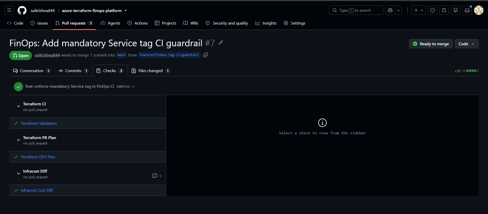
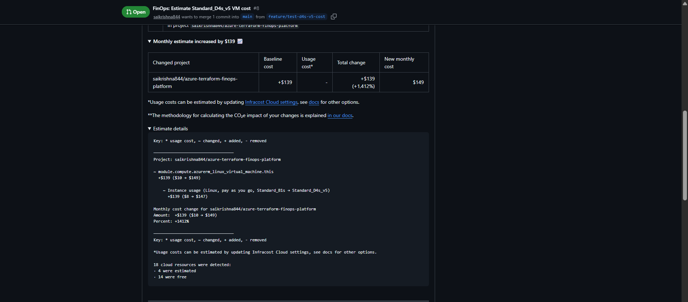
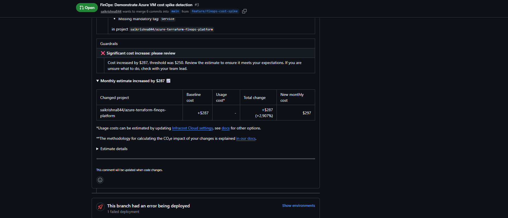
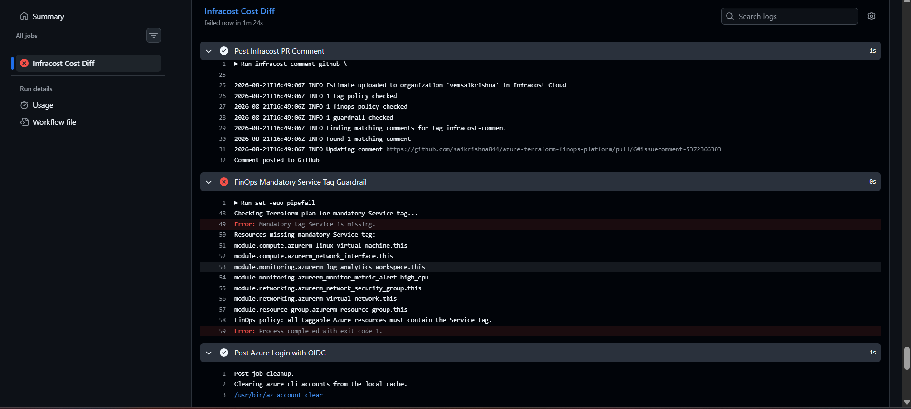

# Azure Terraform FinOps Platform

An Azure Infrastructure-as-Code project that integrates **Terraform, GitHub Actions, Microsoft Azure, OIDC authentication, Infracost, FinOps cost governance, tagging enforcement, and protected pull-request workflows**.

The goal of this project is not only to deploy cloud infrastructure, but to answer an important question **before deployment**:

> How much will this infrastructure change cost, and does it comply with our cloud governance policies?

---

## Project Overview

Traditional Terraform pipelines commonly perform:

```text
terraform fmt
terraform validate
terraform plan
terraform apply
```

This project extends that workflow with **FinOps controls before deployment**.

```text
Developer changes Terraform
            |
            v
      Feature Branch
            |
            v
       Pull Request
            |
            v
+---------------------------+
| Terraform Validation      |
+---------------------------+
            |
            v
+---------------------------+
| Azure Login using OIDC    |
+---------------------------+
            |
            v
+---------------------------+
| Terraform Plan            |
+---------------------------+
            |
            v
+---------------------------+
| Infracost Cost Analysis   |
+---------------------------+
            |
            v
+---------------------------+
| FinOps Governance         |
|                           |
| Cost Guardrail            |
| Mandatory Tags            |
+---------------------------+
            |
       +----+----+
       |         |
       v         v
     PASS       FAIL
       |         |
       v         v
 Merge Allowed  Merge Blocked
```

The infrastructure is therefore validated for both:

- **Technical correctness**
- **Financial and governance compliance**

before changes are merged.

---

## Key Features

### Terraform Infrastructure as Code

The Azure infrastructure is managed using reusable Terraform modules for:

- Resource groups
- Networking
- Linux virtual machines
- Monitoring
- Governance
- Azure Policy

The project follows a modular structure to make infrastructure reusable and easier to maintain.

### Secure Azure Authentication with OIDC

GitHub Actions authenticates to Microsoft Azure using **OpenID Connect (OIDC)**.

This removes the requirement to store long-lived Azure client secrets inside GitHub.

```text
GitHub Actions
      |
      | OIDC Token
      v
Microsoft Entra ID
      |
      v
Azure Subscription
```

### Terraform Pull Request Validation

Every pull request targeting `main` runs automated checks including:

```text
Terraform Format
Terraform Validate
Terraform Plan
```

Infrastructure changes can therefore be reviewed before deployment.

### Pre-Deployment Cost Estimation

Infracost analyzes the Terraform plan and estimates the expected Azure infrastructure cost directly inside the GitHub pull request.

This allows engineers to understand the financial impact of infrastructure changes **before resources are deployed**.

### Cost Increase Guardrail

A FinOps guardrail is configured to detect significant monthly cost increases.

Current demonstration threshold:

```text
$250 monthly increase
```

When the estimated increase exceeds the configured threshold, the Infracost check fails and the pull request can be blocked.

### Mandatory Service Tag Guardrail

The CI pipeline also validates that taggable Azure resources contain the required:

```text
Service
```

tag.

This demonstrates how cloud governance requirements can be enforced automatically during the pull-request process.

### Protected Main Branch

Direct pushes to `main` are blocked.

Changes must pass through a pull request with the following required checks:

```text
Terraform Validation
Terraform DEV Plan
Infracost Cost Diff
```

Force pushes are also blocked.

---

# FinOps Demonstrations

## 1. Successful FinOps Pipeline

A normal infrastructure pull request runs Terraform validation, Terraform planning and Infracost analysis before the change can be merged.



This creates a workflow where infrastructure changes are reviewed technically and financially before deployment.

---

## 2. Azure VM Cost Estimation Before Deployment

To demonstrate pre-deployment cost estimation, the DEV VM size was temporarily changed from:

```hcl
vm_size = "Standard_B1s"
```

to:

```hcl
vm_size = "Standard_D4s_v5"
```

No Terraform apply was required to discover the expected cost difference.

Infracost calculated:

| Cost | Standard_B1s | Standard_D4s_v5 |
|---|---:|---:|
| VM estimated monthly cost | ~$8 | ~$147 |
| Entire project estimate | ~$10 | ~$149 |
| Monthly increase | | **+$139** |
| Percentage increase | | **+1,412%** |



This demonstrates one of the main benefits of FinOps integration:

> Engineers can identify expensive infrastructure decisions during code review instead of after receiving the Azure bill.

The values above represent Infracost estimates captured during the demonstration and may vary with Azure pricing, region, discounts, reservations and usage.

---

## 3. Cost Spike Detection and Automatic Guardrail

A second test intentionally changed the DEV VM from:

```text
Standard_B1s
```

to:

```text
Standard_D8s_v5
```

Infracost detected approximately:

```text
Monthly increase: +$287
Configured threshold: $250
```

Because:

```text
$287 > $250
```

the FinOps guardrail failed.



The infrastructure was **not applied**.

This demonstrates:

```text
Terraform change
      |
      v
Estimated cost increase
      |
      v
+$287/month
      |
      v
Threshold = $250
      |
      v
FinOps Guardrail FAILED
      |
      v
Pull Request Blocked
```

This protects teams from accidental high-cost infrastructure changes.

---

## 4. Mandatory Service Tag Enforcement

Cloud resources should contain proper tags for:

- Cost allocation
- Ownership
- Environment identification
- Reporting
- FinOps visibility

This project therefore requires a:

```text
Service
```

tag.

A test pull request intentionally removed the Service tag.

Terraform itself could still process the infrastructure configuration, but the custom FinOps governance check detected the missing tag.



The pipeline identified resources such as:

```text
Azure Linux Virtual Machine
Network Interface
Log Analytics Workspace
Metric Alert
Network Security Group
Virtual Network
Resource Group
```

as missing the mandatory Service tag.

The pipeline then returned:

```text
Error: Mandatory tag Service is missing.
```

and failed the FinOps governance check.

This demonstrates an important cloud engineering principle:

> A Terraform configuration can be technically valid while still violating organizational governance requirements.

---

# FinOps Governance Model

The project currently demonstrates two major governance controls.

| Control | Purpose | Result |
|---|---|---|
| Cost increase guardrail | Detect unexpectedly expensive infrastructure changes | Blocks large cost increases |
| Mandatory Service tag | Ensure resources are categorized for FinOps | Blocks untagged resources |

These controls run before infrastructure deployment.

---

# GitHub Pull Request Workflow

```text
Feature Branch
      |
      v
Pull Request
      |
      +-----------------------------+
      |                             |
      v                             v
Terraform Validation        Terraform DEV Plan
      |                             |
      +-------------+---------------+
                    |
                    v
             Infracost Cost Diff
                    |
                    v
             FinOps Guardrails
                    |
          +---------+---------+
          |                   |
          v                   v
        PASS                 FAIL
          |                   |
          v                   v
     Merge Allowed      Merge Blocked
```

---

# Repository Structure

```text
azure-terraform-finops-platform/
|
|-- .github/
|   `-- workflows/
|       |-- terraform-ci.yml
|       |-- terraform-pr-plan.yml
|       `-- infracost-diff.yml
|
|-- bootstrap/
|
|-- environments/
|   `-- dev/
|       |-- backend.tf
|       |-- ci.tfvars
|       |-- locals.tf
|       |-- main.tf
|       |-- outputs.tf
|       |-- providers.tf
|       `-- variables.tf
|
|-- modules/
|   |-- compute/
|   |-- governance/
|   |-- monitoring/
|   |-- networking/
|   `-- resource-group/
|
|-- policies/
|
|-- screenshots/
|   |-- 01-d4s-v5-cost-estimate.png
|   |-- 02-cost-guardrail-blocked.png
|   |-- 03-service-tag-guardrail-blocked.png
|   |-- 04-github-merge-blocked.png
|   `-- 05-successful-finops-pipeline.png
|
|-- .gitignore
`-- README.md
```

Terraform state, Terraform plan files, local cache directories and generated artifacts are excluded from Git.

---

# Technologies Used

| Technology | Purpose |
|---|---|
| Microsoft Azure | Cloud infrastructure |
| Terraform | Infrastructure as Code |
| GitHub | Source control |
| GitHub Actions | CI automation |
| Microsoft Entra ID | Identity platform |
| OIDC | Passwordless GitHub-to-Azure authentication |
| Infracost | Infrastructure cost estimation |
| Azure Policy | Governance |
| GitHub Rulesets | Protected branch and merge governance |
| PowerShell | Local automation and Git operations |

---

# Security Practices

The project demonstrates several security and DevOps practices:

```text
OIDC instead of long-lived Azure secrets
Protected main branch
Pull-request based changes
Required CI checks
Blocked force pushes
Terraform generated files excluded from Git
Terraform state excluded from source control
Infrastructure reviewed before deployment
```

---

# Why FinOps Matters

Without FinOps controls:

```text
Terraform Apply
      |
      v
Infrastructure Created
      |
      v
Azure Bill Arrives
      |
      v
Cost Problem Discovered
```

With this project:

```text
Terraform Pull Request
      |
      v
Infracost Estimate
      |
      v
FinOps Governance
      |
      v
Cost Problem Detected
      |
      v
Deployment Prevented
```

The cost conversation therefore moves from:

> "Why did our Azure bill increase?"

to:

> "Should we approve this infrastructure cost before deployment?"

---

# Example FinOps Scenario

Consider an engineer changing:

```hcl
vm_size = "Standard_B1s"
```

to:

```hcl
vm_size = "Standard_D8s_v5"
```

Terraform considers this a valid infrastructure change.

However, Infracost determines that the change increases estimated monthly cost by:

```text
+$287/month
```

The project's configured guardrail allows only:

```text
+$250/month
```

Therefore:

```text
Terraform Validation     PASS
Terraform Plan           PASS
Infracost Estimation     PASS
FinOps Cost Policy       FAIL
Merge                    BLOCKED
```

This is an example of **Policy-as-Code and FinOps working together**.

---

# What I Learned

This project provided hands-on experience with:

- Designing modular Terraform infrastructure
- Azure remote-state workflows
- GitHub pull-request automation
- Azure authentication using OIDC
- Terraform CI validation
- Terraform plan automation
- Infracost integration
- Cloud cost estimation
- FinOps cost guardrails
- Mandatory tagging governance
- GitHub branch protection
- Terraform state locking
- Troubleshooting CI/CD failures
- Pre-deployment infrastructure governance

---

# Engineering Summary

This project implements a pre-deployment FinOps governance workflow for Azure infrastructure managed with Terraform.

Every infrastructure change is submitted through a GitHub pull request. GitHub Actions authenticates to Azure using OIDC, validates the Terraform configuration, generates a Terraform plan, and passes the plan to Infracost for cost estimation.

The workflow also enforces FinOps guardrails such as cost-increase thresholds and mandatory resource tagging.

For example, changing the DEV virtual machine from `Standard_B1s` to `Standard_D8s_v5` produced an estimated monthly increase of approximately `$287`. Because this exceeded the configured `$250` threshold, the FinOps check failed and the change was prevented from being merged.

The project also demonstrates governance enforcement by detecting Azure resources that are missing the mandatory `Service` tag, even when the Terraform configuration itself is technically valid.

---

# Project Outcome

This project demonstrates how Terraform can be extended beyond infrastructure deployment into a controlled cloud engineering platform combining:

```text
Infrastructure as Code
+
CI/CD
+
Identity Security
+
Cost Visibility
+
FinOps
+
Governance
+
Policy Enforcement
```

The result is a workflow where cloud infrastructure changes are evaluated for **correctness, security, governance and financial impact before deployment**.

---

## Disclaimer

This repository is a hands-on demonstration project.

Infrastructure pricing shown in the screenshots represents Infracost estimates at the time the tests were performed. Actual Microsoft Azure costs can vary based on region, consumption, reservations, savings plans, licensing, discounts and other billing factors.